<div align="center">



<br>


<br>

<div align="center">


<br>


<br>


</div>

<div align="center">

<a href="https://github.com/nihacode">

</a>

<a href="https://www.linkedin.com/in/nihax/">

</a>

<a href="mailto:mail.niharika.s.3@gmail.com">

</a>

</div>

<br>


</div>

---

## ☀️ STELLAR IDENTITY — `niharika.stellar`

```
╔══════════════════════════════════════════════════════════════════════╗
║              ✦  NIHARIKA_SINGH.stellar  v2026.LTS  ✦                ║
╠══════════════════════════════════════════════════════════════════════╣

niharika = {
    "role"        : "SDE Intern @ Ridlin 🚀",
    "also"        : "Joint Technical Head @ ECESA, KJSSE 🎖️",
    "education"   : "B.Tech CSBS @ KJ Somaiya School of Engineering 🎓",
    "honors"      : "Quantum Computing & Generative AI ✨",
    "cgpa"        : 9.30,
    "location"    : "Mumbai, India 🇮🇳  (UTC +5:30)",
    "contact"     : "mail.niharika.s.3@gmail.com 📡",

    "orbital_stack": [
        "MERN Stack     →  React.js | Next.js | Node.js | Express",
        "Data Universe  →  Python | Pandas | NumPy | Tableau",
        "Styling Nebula →  Tailwind CSS | CSS3 | Figma | Canva",
        "Databases      →  MySQL | PostgreSQL",
        "Launch Pad     →  GitHub | Vercel | VS Code | Flask",
    ],

    "numbers_that_hit_different": {
        "Production pages shipped"  : "12+ pages ⚡",
        "Users acquired at launch"  : "500+ in month 1 🔥",
        "Hackathon teams managed"   : "70+ teams | 300+ participants 🏆",
        "Events executed"           : "30+ teams across Abhiyantriki 2025",
        "Murder Mystery solve time" : "Fastest: 1 hr 43 mins 🕵️",
        "Completion rate"           : "35-40% on live technical game",
        "Dashboard built for"       : "UIDAI Data Hackathon 2026 📊",
    },

    "current_mission"  : "Build things that outlive the sprint 🌠",
    "fun_fact"         : "I shipped 12 production pages & ran a 300-person hackathon. Simultaneously. 💀",
}

╚══════════════════════════════════════════════════════════════════════╝
```

---

## 🏆 ACHIEVEMENTS UNLOCKED — `stellar_log.txt`

```
╔════════════════════════════════════════════════════════════════════════╗
║                                                                        ║
║  🚀  12+ PRODUCTION PAGES  ─  End-to-end marketplace @ Ridlin         ║
║                                                                        ║
║  🌟  500+ USERS  ─  Acquired in month 1 of e-commerce launch          ║
║  🎮  MURDER MYSTERY  ─  Full-stack game for 100+ live participants     ║
║  📊  UIDAI HACKATHON  ─  Aadhar Analytics Dashboard, 2026             ║
║  🌾  STANS PLATFORM  ─  Farmer empowerment site, deployed & live      ║
║  👥  300+ PARTICIPANTS  ─  AgriTech hackathon lead, 70+ teams         ║
║  🎖️  JOINT TECH HEAD  ─  ECESA, KJSSE Technical Council               ║
║  🎓  CGPA 9.30  ─  Honors: Quantum Computing + Generative AI         ║
║                                                                        ║
╚════════════════════════════════════════════════════════════════════════╝
```

---

## 🌐 LIVE CONSTELLATIONS — `deployed_stars/`

> Click to visit the live deployments 👇

| ⭐ Project | 🛰️ Stack | 🔗 Live Link |
|------------|-----------|-------------|
| 🕵️ Murder Mystery — Abhiyantriki 2025 | React · TypeScript · Node.js | [murder-mystery-cyan.vercel.app](https://murder-mystery-cyan.vercel.app) |
| 🌾 S.T.A.N.S — Farmer Empowerment Platform | React.js · Tailwind CSS · Vercel | [stans.vercel.app](https://stans.vercel.app) |
| 📊 Aadhar Enrolment Analytics Dashboard | Tableau · Excel · Canva | UIDAI Hackathon 2026 |

---

## 🛰️ TECH ARSENAL — `stellar_weapons/`

<div align="center">

### 🌌 Languages


### 🎨 Frontend Nebula


### 🚀 Backend Orbit


### 🗄️ Data Core


### 🔧 Launch Pad & Tools


</div>

---

## 📡 MISSION LOG — `experience.log`

```bash
❯ cat /var/log/niharika/missions.log

━━━━━━━━━━━━━━━━━━━━━━━━━━━━━━━━━━━━━━━━━━━━━━━━━━━━━━━━━━━━━━━

[ACTIVE]   SDE Intern @ Ridlin                  Jul 2025 – Sep 2025
           → Architected 12+ production-grade pages (Marketplace)
           → React.js + Next.js + Tailwind CSS — modular & scalable
           → Business Dashboard: Settings & Analytics modules
           → RESTful API integration + lazy loading + perf tuning
           → Result: smooth cross-device UX across all screen sizes

[ACTIVE]   Joint Technical Head @ ECESA, KJSSE  Aug 2025 – Mar 2026
           → Ran infra for national AgriTech hackathon: 70+ teams
           → 300+ participants — live issue resolution under pressure
           → Executed all technical events for Abhiyantriki 2025

[PAST]     Frontend Intern @ ZecBay             Dec 2024 – Jan 2025
           → Built responsive e-commerce platform: HTML + CSS + Flask
           → Figma UI/UX prototypes for intuitive navigation
           → 500+ user sign-ups in first month post-launch 🔥

[PAST]     Data Analytics Intern (In-house)
           → Multi-category YouTube data analysis (Tech/Gaming/Vlogs)
           → Python (Pandas + NumPy) pipeline for engagement trends
           → Visualized insights via Matplotlib + Tableau

━━━━━━━━━━━━━━━━━━━━━━━━━━━━━━━━━━━━━━━━━━━━━━━━━━━━━━━━━━━━━━━
```

---

## 🌠 FEATURED CONSTELLATIONS — `projects/`

<div align="center">

| 🪐 Constellation | 🌌 Orbit | 📡 Signal |
|-------------------|----------|-----------|
| 🕵️ **Murder Mystery** — Abhiyantriki 2025 | Full-stack technical game for 100+ live participants; forensic logic, multi-round challenges, TypeScript real-time branching | 35-40% completion rate; fastest solve: 1h 43m |
| 📊 **Aadhar Enrolment Dashboard** — UIDAI Hackathon 2026 | State & district-level KPIs, rankings, trends, interactive filters | Tableau · Excel · Canva |
| 🌾 **S.T.A.N.S** — Farmer Empowerment Platform | Production-grade responsive website; optimized UI/UX; cross-device | React.js · Tailwind CSS · Vercel |

</div>

---

## 📊 GITHUB UNIVERSE — `git_stats.stellar`

<div align="center">


<br>


<br><br>


<br><br>


<br><br>


</div>

---

## ☀️ THE SUN DEVOURS YOUR COMMITS — `solar_hunger.exe`

> *Every contribution you make feeds the star. The Sun grows stronger. Keep committing.* 🌞

<div align="center">


<br><br>

<!-- Contribution Heatmap via githubtrends -->


<br><br>

<!-- Full contribution calendar -->


<br>
<sub>🌞 <i>The Sun animation above auto-updates daily via GitHub Actions — trigger the <b>solar-hunger</b> workflow once to activate it!</i></sub>

</div>

---

## 📈 STELLAR ACTIVITY GRAPH — `orbit_trace/`

<div align="center">


</div>

---

## 🌌 STAR MAP — `education.stellar`

```
╔════════════════════════════════════════════════════════════════╗
║                                                                ║
║  🎓  B.Tech Computer Science (Business Systems)                ║
║      KJ Somaiya School of Engineering  |  2024–2028            ║
║      CGPA: 9.30  |  Honors: Quantum Computing + GenAI  🌌     ║
║                                                                ║
║  📚  12th Boards — PACE Junior Science College  |  2024        ║
║      Score: 75.5%                                              ║
║                                                                ║
║  📚  10th Boards — Podar International School  |  2022         ║
║      Score: 93.2%  🏅                                          ║
║                                                                ║
╚════════════════════════════════════════════════════════════════╝
```

---

## 🚀 TRANSMISSION COMPLETE — `signal_out.txt`

<div align="center">

```
█████████████████████████████████████████████████████████████████
█                                                               █
█   ✦  "Ship fast. Design beautifully. Analyze deeply."  ✦     █
█                                                               █
█   > OPEN TO  :  Internships | Collabs | Hackathons            █
█   > REACH ME :  mail.niharika.s.3@gmail.com                   █
█   > GITHUB   :  github.com/nihacode                           █
█   > LINKEDIN :  linkedin.com/in/nihax                         █
█                                                               █
█   > STATUS   :  🟢 ONLINE — Currently building something     █
█                  that doesn't exist yet.                      █
█                                                               █
█████████████████████████████████████████████████████████████████
```

<br>


</div>


