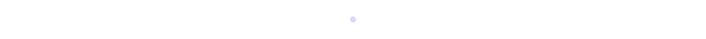
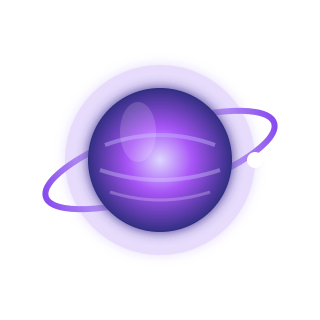

<div align="center">


</div>


<div align="center">

# ✨ Welcome to My Universe ✨

*"Every project begins as a tiny star.*

*With enough curiosity, it becomes a galaxy."*

</div>


# 🌙 About Me

```yaml
Name: Niharika Singh

Location: Mumbai, India

Role:
  - Software Developer
  - Data Analyst
  - AI/ML Enthusiast

Currently Learning:
  - Deep Learning
  - Machine Learning
  - Cloud Computing
  - Generative AI

Interests:
  - Hackathons
  - Open Source
  - Data Analytics
  - Problem Solving

Life Philosophy:
  "Keep building.
   Keep learning.
   Keep shining."
```



# 🚀 Current Mission

```text
🌌 AI Projects
██████████████████░░ 90%

📊 Data Analytics
████████████████░░░░ 80%

🤖 Deep Learning
██████████████░░░░░░ 70%

☁ Cloud Computing
████████████░░░░░░░░ 60%
```


# ⭐ Tech Galaxy

<div align="center">


</div>

---

<div align="center">

## 🌠 Tonight's Constellation

*"Stars don't compete.*

*They shine together."*

</div>



# 🪐 Featured Constellations

| Planet | Description |
|---------|-------------|
| 🌍 AI Environmental Monitoring | AI-powered safety monitoring for construction sites |
| 🪐 AI Virtual Try-On | Deep learning based virtual clothing try-on |
| 🌕 Data Analytics Dashboard | Tableau, Python & Power BI |
| ☄️ Web Development | React, Node.js & Full Stack Applications |


# 📊 GitHub Universe

<div align="center">


</div>

<div align="center">


</div>


<div align="center">


</div>


<div align="center">

## 🌌 Let's Connect

<a href="https://github.com/YOUR_USERNAME">

</a>

<a href="https://linkedin.com/in/YOUR_LINKEDIN">

</a>

<a href="mailto:YOUR_EMAIL">

</a>

</div>


<div align="center">



### ⭐ Thanks for Visiting My Universe ⭐

*"Keep building. Keep learning. Keep shining."*

</div>